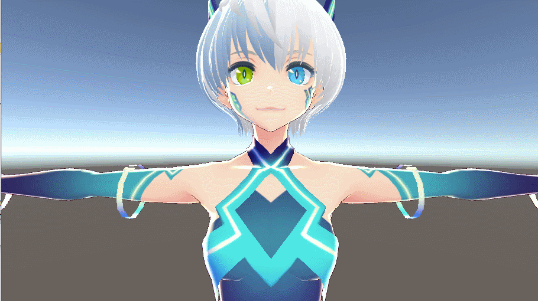
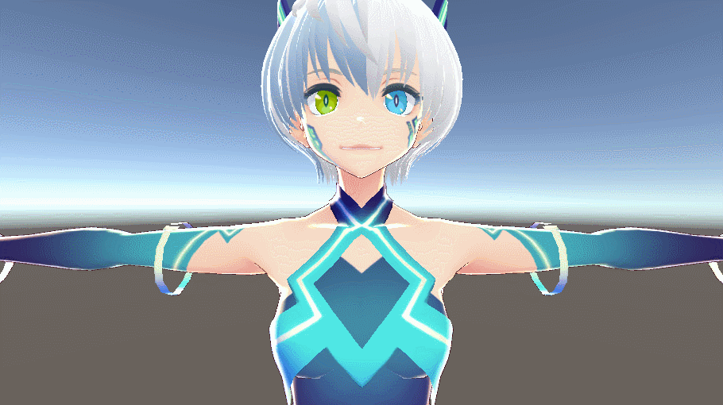

# VRM LipSync Sample

Oculus Lipsync

SALSA

## Third party assets
You need to import the following assets.
- [Oculus Lipsync Unity Plugin 1.30.0](https://developer.oculus.com/downloads/package/oculus-lipsync-unity/1.30.0/)

- [SALSA With RandomEyes](https://assetstore.unity.com/packages/tools/animation/salsa-with-randomeyes-16944)

- [UniVRM v0.44](https://github.com/dwango/UniVRM/releases/tag/v0.44)  

- [Vita](https://hub.vroid.com/characters/6193066630030526355/models/3525604181073039892)

## License
- [MIT License](https://github.com/sotanmochi/VRMLipSyncSample/blob/master/LICENSE.txt)

## Tested Environment
- Unity 2017.4.14f1
